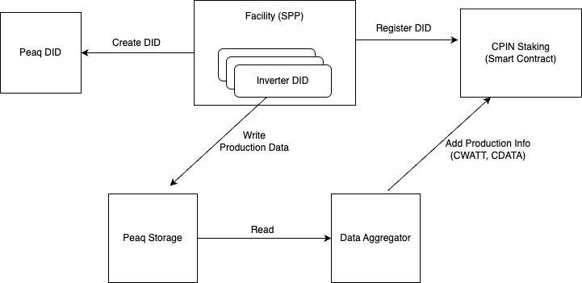

# CPIN Data Aggregator

This data aggregator service is a backend project that collects data from Peaq storage and updates the staking contract.

## Architecture

- Periodically gets Facility information and registered DIDs from the staking contract
- Every collected data is in the Peaq storage with the following format
  - cpin-production-2025-03-13-10 (the last number is the hour in range of 0-23)
- Data Aggregator, tracks all registered Dids and reads production information and aggregates them by facility
  and sends this information to staking contract.
